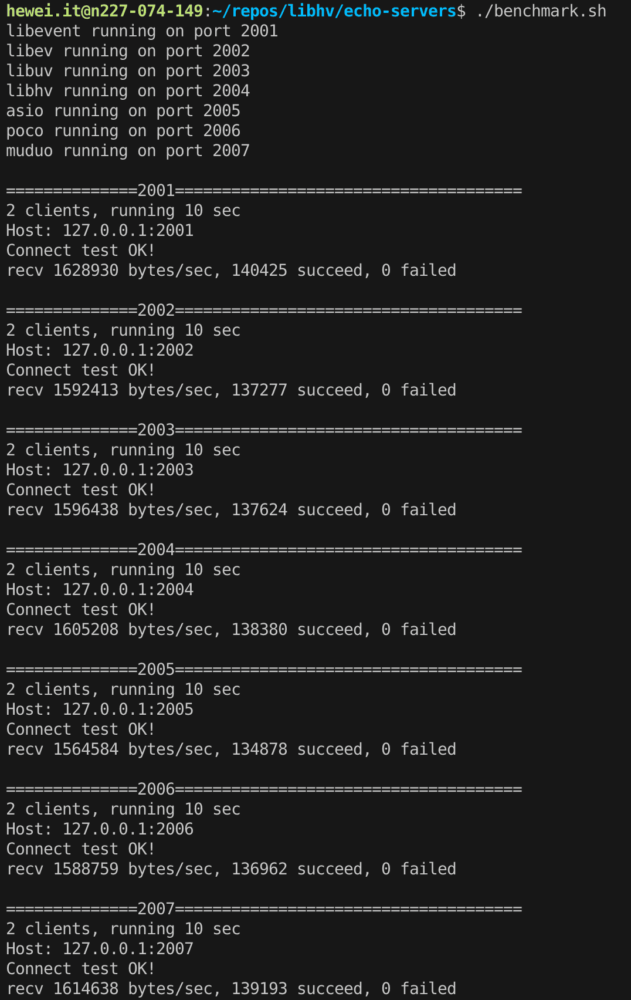

[](https://travis-ci.org/ithewei/libhv)

## 简介

`libhv`是一个类似于`libevent、libev、libuv`的跨平台网络库，提供了更简单的接口和更丰富的协议。

## 特征

- cross-platform (Linux, Windows, Mac)
- event-loop (IO, timer, idle)
- ENABLE_IPV6
- ENABLE_UDS (Unix Domain Socket)
- WITH_OPENSSL or WITH_MBEDTLS
- http client/server (include https http1/x http2 grpc)
- http web service, indexof service, api service (support RESTful API)
- protocols
    - dns
    - ftp
    - smtp
- apps
    - ifconfig
    - ping
    - nc
    - nmap
    - nslookup
    - ftp
    - sendmail
    - httpd
    - curl

## 入门
```
./getting_started.sh
```

### HTTP
#### http server
see `examples/httpd/httpd.cpp`
```c++
#include "HttpServer.h"

int main() {
    HttpService service;
    service.base_url = "/v1/api";
    service.POST("/echo", [](HttpRequest* req, HttpResponse* res) {
        res->body = req->body;
        return 200;
    });

    http_server_t server;
    server.port = 8080;
    server.service = &service;
    http_server_run(&server);
    return 0;
}
```
#### http client
see `examples/curl.cpp`
```c++
#include "http_client.h"

int main(int argc, char* argv[]) {
    HttpRequest req;
    req.method = HTTP_POST;
    req.url = "http://localhost:8080/v1/api/echo";
    req.body = "hello,world!";
    HttpResponse res;
    int ret = http_client_send(&req, &res);
    printf("%s\n", req.Dump(true,true).c_str());
    if (ret != 0) {
        printf("* Failed:%s:%d\n", http_client_strerror(ret), ret);
    }
    else {
        printf("%s\n", res.Dump(true,true).c_str());
    }
    return ret;
}
```

```shell
git clone https://github.com/ithewei/libhv.git
cd libhv
make httpd curl

bin/httpd -h
bin/httpd -d
#bin/httpd -c etc/httpd.conf -s restart -d
ps aux | grep httpd

# http web service
bin/curl -v localhost:8080

# http indexof service
bin/curl -v localhost:8080/downloads/

# http api service
bin/curl -v localhost:8080/ping
bin/curl -v localhost:8080/echo -d "hello,world!"
bin/curl -v localhost:8080/query?page_no=1\&page_size=10
bin/curl -v localhost:8080/kv   -H "Content-Type:application/x-www-form-urlencoded" -d 'user=admin&pswd=123456'
bin/curl -v localhost:8080/json -H "Content-Type:application/json" -d '{"user":"admin","pswd":"123456"}'
bin/curl -v localhost:8080/form -F "user=admin pswd=123456"
bin/curl -v localhost:8080/upload -F "file=@LICENSE"

bin/curl -v localhost:8080/test -H "Content-Type:application/x-www-form-urlencoded" -d 'bool=1&int=123&float=3.14&string=hello'
bin/curl -v localhost:8080/test -H "Content-Type:application/json" -d '{"bool":true,"int":123,"float":3.14,"string":"hello"}'
bin/curl -v localhost:8080/test -F 'bool=1 int=123 float=3.14 string=hello'
# RESTful API: /group/:group_name/user/:user_id
bin/curl -v -X DELETE localhost:8080/group/test/user/123

# webbench (linux only)
make webbench
bin/webbench -c 2 -t 60 localhost:8080
```

**libhv(port:8080) vs nginx(port:80)**


### EventLoop
see `examples/tcp.c` `examples/udp.c`
```c
// TCP echo server
#include "hloop.h"

void on_close(hio_t* io) {
}

void on_recv(hio_t* io, void* buf, int readbytes) {
    hio_write(io, buf, readbytes);
}

void on_accept(hio_t* io) {
    hio_setcb_close(io, on_close);
    hio_setcb_read(io, on_recv);
    hio_read(io);
}

int main(int argc, char** argv) {
    if (argc < 2) {
        printf("Usage: cmd port\n");
        return -10;
    }
    int port = atoi(argv[1]);

    hloop_t* loop = hloop_new(0);
    hio_t* listenio = hloop_create_tcp_server(loop, "0.0.0.0", port, on_accept);
    if (listenio == NULL) {
        return -20;
    }
    hloop_run(loop);
    hloop_free(&loop);
    return 0;
}
```
```shell
make tcp udp nc
bin/tcp 1111
bin/nc 127.0.0.1 1111

bin/udp 2222
bin/nc -u 127.0.0.1 2222

make hloop_test
bin/hloop_test
bin/nc 127.0.0.1 10514
```

## 构建
见BUILD.md

### 库
- make libhv
- sudo make install

### 示例
- make examples
    - make tcp   # tcp server
    - make udp   # udp server
    - make nc    # network client
    - make nmap  # host discovery
    - make httpd # http server
    - make curl  # http client

### 单元测试
- make unittest

### 编译选项

#### 编译WITH_OPENSSL
在libhv中开启SSL非常简单，仅需要两个API接口：
```
// init ssl_ctx, see base/hssl.h
hssl_ctx_t hssl_ctx_init(hssl_ctx_init_param_t* param);

// enable ssl, see event/hloop.h
int hio_enable_ssl(hio_t* io);
```

https就是做好的例子:
```
sudo apt install openssl libssl-dev # ubuntu
make clean
make WITH_OPENSSL=yes
# editor etc/httpd.conf => ssl = on
bin/httpd -s restart -d
bin/curl -v https://localhost:8080
curl -v https://localhost:8080 --insecure
```

#### 编译WITH_CURL
```
make WITH_CURL=yes DEFINES="CURL_STATICLIB"
```

#### 编译WITH_NGHTTP2
```
sudo apt install libnghttp2-dev # ubuntu
make clean
make WITH_NGHTTP2=yes
bin/httpd -d
bin/curl -v localhost:8080 --http2
```

#### 更多选项
见config.mk

### echo-servers
```shell
cd echo-servers
./build.sh
./benchmark.sh
```

**echo-servers/benchmark**<br>


### 数据结构
- array.h:       动态数组
- list.h:        链表
- queue.h:       队列
- heap.h:        堆

### base
- hv.h：         总头文件
- hexport.h:     导出宏
- hplatform.h:   平台相关宏
- hdef.h:        常用宏定义
- hatomic.h:     原子操作
- herr.h:        错误码
- htime.h:       时间日期
- hmath.h:       数学函数
- hbase.h:       基本接口
- hversion.h:    版本
- hsysinfo.h:    系统信息
- hproc.h:       进程
- hthread.h：    线程
- hmutex.h：     互斥锁
- hsocket.h:     套接字
- hssl.h:        SSL/TLS加密通信
- hlog.h:        日志
- hbuf.h:        缓存
- hstring.h:     字符串
- hvar.h:        var变量
- hobj.h:        对象基类
- hfile.h:       文件类
- hdir.h:        ls实现
- hurl.h:        URL相关
- hscope.h:      作用域
- hthreadpool.h: 线程池
- hobjectpool.h: 对象池
- ifconfig.h:    ifconfig实现

### utils
- hmain.h:       命令行解析
- hendian.h:     大小端
- iniparser.h:   ini解析
- singleton.h:   单例模式
- md5.h:         MD5数字摘要
- base64.h:      base64编码
- json.hpp:      json解析

### event
- hloop.h:       事件循环
- nlog.h:        网络日志
- nmap.h:        nmap实现

#### iowatcher
- EVENT_SELECT
- EVENT_POLL
- EVENT_EPOLL   (linux only)
- EVENT_KQUEUE  (mac/bsd)
- EVENT_PORT    (solaris)
- EVENT_IOCP    (windows only)

### http
- http_client.h: http客户端
- HttpServer.h:  http服务端

### protocol
- dns.h:         DNS域名查询
- icmp.h:        ping实现
- ftp.h:         FTP文件传输协议
- smtp.h:        SMTP邮件传输协议

## 学习资料

- libhv 博客专栏: <https://hewei.blog.csdn.net/category_9866493.html>
- libhv QQ群`739352073`，欢迎加群讨论
